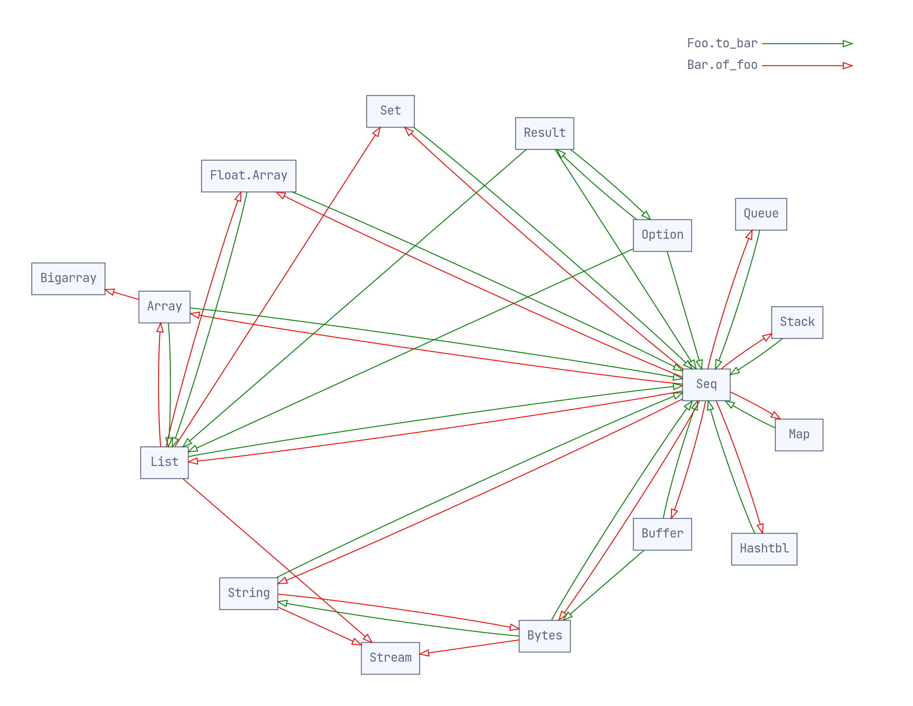
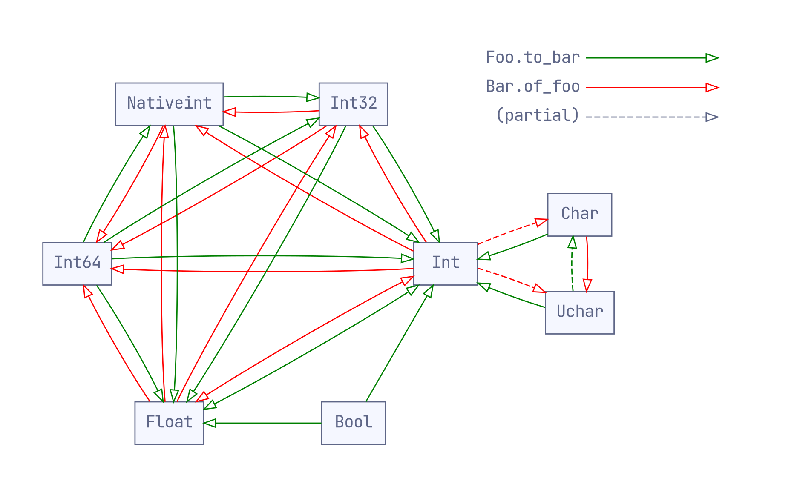

# Converting between standard OCaml types

The OCaml standard library provides many convertion functions of the form
`Foo.{to,of}_bar` between its various types. These are incomplete – and somewhat
arbitrary – so it's often necessary to go via intermediate types to achieve the
convertion you want. (Either that or roll your own with a `fold` or `iter`
function.)

What's worse, you may need to mix forwards and backwards conversions (`to_` and
`of_` style respectively), requiring you to search both forwards and backwards
in the documentation to get the conversion you need. For example, consider the
case of `('k, 'v) Hashtbl.t -> ('k * 'v) list`:

1. Looking in the docs for [`Hashtbl`][hashtbl-doc], we see that there's no
   direct conversion to an association list. We might give up and build our own
   one with `Hashtbl.fold`. On OCaml 4.07+, we have `Hashtbl.to_seq : ('k, 'v) Hashtbl.t -> ('k, 'v) Seq.t`, so let's start by using that.

1. We look in the docs for [`Seq`][seq-doc], and find no conversions. Once again,
   we could use get distracted and use `Seq.fold_left` to build our own. Or, we
   could start searching backwards from the type we want...

1. In the docs for [`List`][list-doc], we find the function `List.of_seq : 'a Seq.t -> 'a List.t`. Now we can complete the chain:

```ocaml
let hashtbl_to_list h = Hashtbl.to_seq h |> List.of_seq
```

Rather than keeping the entire Stdlib documentation open in browser tabs, it can
be helpful to view all of the available conversions as a directed graph. That's
what this repository provides. (These graphs show the conversions available on
OCaml 4.11.0; your mileage may vary.)

[hashtbl-doc]: https://caml.inria.fr/pub/docs/manual-ocaml/libref/Hashtbl.html
[seq-doc]: https://caml.inria.fr/pub/docs/manual-ocaml/libref/Seq.html
[list-doc]: https://caml.inria.fr/pub/docs/manual-ocaml/libref/List.html

## Container types



Take-aways:

- The common containers are ordered by:

  - `Array` ⊏ `List` ⊏ `Seq`
  - `Buffer` ⊏ `Bytes` ⊏ `String` ⊏ `Seq`
  - {`Hashtbl`, `Map`, `Queue`, `Set`, `Stack`} ⊏ `Seq`

- To convert between containers `Foo.t` → `Bar.t`, it's usually necessary to go
  via `Seq.t` with `Foo.to_seq >> Bar.of_seq`.

- There's no direct conversion between `float Array.t` and `Float.Array.t`.

## Data types



Take-aways:

- The numeric modules are ordered by `Int64` ⊏ `Nativeint` ⊏ `Int32` ⊏ {`Int`,
  `Float`}. When coercing between them, you should check modules in this order.
